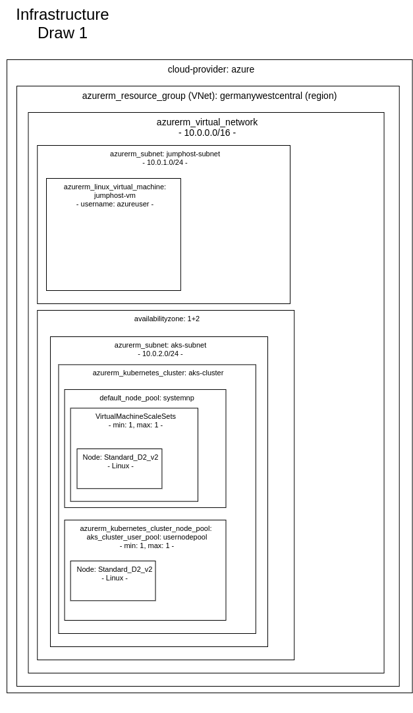

# Azure-Cluster-PW
This repository represents an attempt to create a cluster on the azure-platform. The central-feature of this infrastructure should have been the aks-service. This cluster was intendet to serve as the backing infrastructure for my personal-website (pw). This approach was choosen after some problem with the amazon-platform (especially with the eks). This cluster was build up via the infrastructure-as-code approach (terraform). A general grafical overview is given below.
Unfortunately i decided to stop working on this aws-approach. The reasons will be described below.





##Learned
 - cluster-infrastructure-components
 - cluster-networking
 - active directory
 - azure-provider
   - vnet
   - azurerm_linux_virtual_machine
   - aks
        - default nodegroups
        - user nodegroups
 - infrastructure-as-code
   - ansible
   - terraform
     - azure provider

## Prerequisites
- azure-account
- active directory - account (to create: see important commands)
- terraform
- kubectl

## Getting Started
To create the cluster of this reposiroty run following command (ATTENTION: THE CODE HAS AN ERROR THAT IS CURRENTLY NOT RESOLVED)
 - run terraform
```
 terraform apply
```

## Important commands
- create service principal, role and authentication-secret the short way
```
 az ad sp create-for-rbac \
     --role="Contributor" \
     --scopes="/subscriptions/SUBSCRIPTION_ID"
```

- output ssh-key to file
```
 terraform output ssh_private_key_pem > \
 ../keys/ssh/azure-ssh-terraform.pem
```

get aks credentials
```
 az aks get-credentials \
    --resource-group $(terraform output -raw resource_group_name) \
    --name $(terraform output -raw kubernetes_cluster_name)
```

kubernetes list all pods
```
 kubectl get pods \
    --all-namespaces
```

create cluster-role-binding for k8s-dashboard
```
kubectl create clusterrolebinding kubernetes-dashboard \
    --clusterrole=cluster-admin \
    --serviceaccount=kube-system:kubernetes-dashboard \
    --user=clusterUser
```

access k8s-dashboard through az (after that you may access http://127.0.0.1:8001/)
```
 az aks browse \
    --resource-group $(terraform output -raw resource_group_name) \
    --name $(terraform output -raw kubernetes_cluster_name)
```

create token in a new terminal-tab (dont interrupt "az aks browse"-process)
```
 kubectl -n kube-system describe secret $( \
    kubectl -n kube-system get secret | \
    grep service-controller-token | \
    awk '{print $1}'
 )
 # copy + paste the token to the dashboard
```


## Build with
- terraform v0.13
- aks (Kubernetes v1.19.6)


## Current State
Some of the code in this repository is not tested. In the development-process appeared errors with terraform. This error were not resolved.

## Why not continued
This project was stated mainly because there was the hope of better handling with the handling of the managed kubernetes-service. But at development the the amazon-plattform (where i worked previously) felt much more mature. On the one hand the platform-api of azure seemd slow (response time and creation-time of components) in a couple of aspects (web-interface, terminal-interface, terraform-interface). On the other hand, it seemed that the terraform provider of azure felt more error-prone. For example there was a situation at the end in which one could not create, adjust or even delete ressourcen because of some error. This kind of error (or actually any other error) i had nether experience while working with aws. A snippet of the error is stored at ./error.txt.
